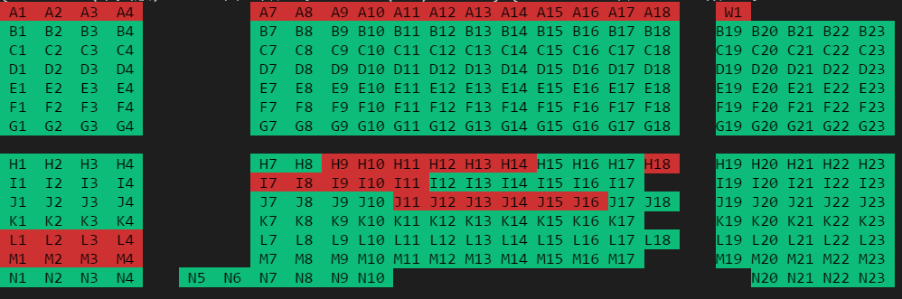

# Taiwan Movie Booking API

[]()
[]()

This package can get movie info and seats layout ,using your own account to book movie ticket.

But it's still under development, I just completed one of subpackage, mm(mirama).

`Note: This is a third party package, not official`


## Dependencies

* [requests](http://docs.python-requests.org/en/master/)
* [bs4](https://www.crummy.com/software/BeautifulSoup/bs4/doc/)
* [lxml](http://lxml.de/)
* [pillow](https://github.com/python-pillow/Pillow)

```
pip3 install requests bs4 lxml Pillow
```
## Usage

[example](example/example.ipynb)

### Config file
* In ./config.json

```json
{
    "mail": "1234@gmail.com",
    "passwd": "1234",
    "phone": "0970000000",
    "name": "XXX",
    "candidate":["I11","I12"]
}
```
* usage
```python
from twmovieapi import user

me = user.User()
print(me.mail)
print(me.phone)
print(me.name)
print(me.candidate)
```
output

```
brian41005@gmail.com
0970000000
bm
['I11', 'I12']
```
### Get screenings info
* Get info
```python
from twmovieapi import mm

# get mirama movie screenings info
info = mm.MovieInfo()

for item in info.get('MM'):
    print(item)
```
output

```
{'name': '(中文版)可可夜總會', 'id': '804097', 'date': '11 月 24日 星期五', 'time': '09:40', 'left': '254'}
```

### Get seat
```python
from twmovieapi import user, mm

u = user.User('config.json')
book = mm.Book(u)

book.login()

info = mm.MovieInfo()
for item in info.get('MM'):
    sid = item['id']
    break
cid = info.getcid('MM')

book.set_screenings(cid, sid)
response = book.set_ticket(discounted=2)

# parse seat info
seatdict = mm.seat.get_seat(response)

# print layout
layout = mm.seat.gen_layout(seatdict)
mm.seat.print_seating_chart(layout)

```
Output



### Booking usage
```python
from twmovieapi import mm, User

usr = User('config.json')
book = mm.Book(usr)

# login
book.login()

# select movie
info = mm.MovieInfo()
for item in info.get('MM'):
    sid = item['id']
    break
cid = info.getcid('MM')

# set cinema and movie
book.set_screenings(cid, sid)

# set ticket
response = book.set_ticket(discounted=2)

# parse seat info
seatdict = mm.seat.get_seat(response)

# print seats layout
mm.seat.print_seating_chart(mm.seat.gen_layout(seatdict))

# set seat
response = book.set_seat([seatdict['B12'][0],
                          seatdict['B11'][0]])
```
then you can parse response
```python
# response a html page
print(response.content.decode())
```

After setting seat, you will find some strings that are about final confirm, 
e.g. "我已經閱讀並同意" or something else.

Mostly, it will succeed, but in some cases:

* B9 B10 B11 B12 anyone of them has been booked

* Your ticketdict {'std': 0,'discount': 2,'heart': 0,'old': 0} is different from your [seatdict['B12'][0], seatdict['B11'][0], seatdict['B9'][0],seatdict['B10'][0]]

You will got seats that you don't expect.

In my observation, their system will put default seats instead of your setting.

* Finally, just confirm it!

```python
# confirm
book.confirm()
```
## About this API